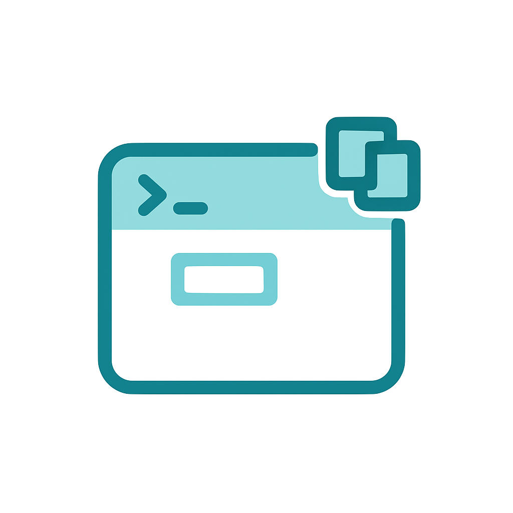

# Terminal Copy On Select

Automatically copy selected text from the VS Code integrated terminal to your clipboard.

Terminal Copy On Select is a lightweight productivity extension for developers who copy terminal output often. Select text in the integrated terminal and paste it anywhere—no right-click menu, no `Ctrl+C`, and no extra command required.

<!-- <p align="center">
  
</p> -->

<!--  -->

<p align="center">
  
</p>

<p align="center">
  
</p>

<p align="center">
<a href="https://kermanx.github.io/Terminal Copy On Select/" target="_blank">
  <!-- 
   -->
  
  
</a>
</p>

<p align="center">
  
  
  
  
</p>

## Why Install It?

- **Copy terminal output faster**: select any text in the VS Code terminal and it is copied automatically.
- **Reduce context switching**: skip right-click menus and keyboard shortcuts when collecting logs, paths, commands, or error messages.
- **Use native VS Code behavior**: enables the built-in `terminal.integrated.copyOnSelection` setting when you have not configured it yet.
- **Keep your preferences**: existing user, workspace, and workspace-folder terminal copy settings are respected.
- **Stay lightweight**: no commands, no UI clutter, and no runtime dependencies.

## Features

- Automatic terminal copy on selection
- Works with the VS Code integrated terminal
- Supports shells such as bash, zsh, fish, PowerShell, Command Prompt, and WSL terminals
- Useful for copying logs, stack traces, file paths, command output, and snippets
- Zero configuration for most users

## Installation

### VS Code Marketplace

1. Open VS Code.
2. Go to **Extensions** with `Ctrl+Shift+X` or `Cmd+Shift+X`.
3. Search for `Terminal Copy On Select`.
4. Click **Install**.

You can also install it from the [VS Code Marketplace](https://marketplace.visualstudio.com/items?itemName=houtan-rocky.terminal-copy-on-select).

### Open VSX

Install from [Open VSX](https://open-vsx.org/extension/houtan-rocky/terminal-copy-on-select) for compatible editors such as VSCodium.

## Usage

1. Open the integrated terminal with `` Ctrl+` `` or `` Cmd+` ``.
2. Select text in the terminal.
3. Paste the copied text anywhere with `Ctrl+V` or `Cmd+V`.

That is it. Terminal selections copy automatically after the extension activates.

## Configuration

This extension uses VS Code's built-in terminal setting:

```json
{
  "terminal.integrated.copyOnSelection": true
}
```

If `terminal.integrated.copyOnSelection` is already configured in your user, workspace, or workspace-folder settings, the extension leaves your value unchanged.

To turn the behavior off later, set the same option to `false` in your VS Code settings:

```json
{
  "terminal.integrated.copyOnSelection": false
}
```

## Commands

This extension does not add commands. It quietly enables terminal copy-on-select behavior and keeps VS Code's command palette clean.

## Troubleshooting

- **Nothing copies after selecting terminal text**: confirm `terminal.integrated.copyOnSelection` is set to `true`.
- **The setting keeps a custom value**: remove the user, workspace, or workspace-folder override if you want the extension to enable it automatically.
- **Clipboard behavior differs by shell or OS**: restart VS Code after installation and test again in the integrated terminal.

## FAQ

### Does this copy editor selections?

No. It only affects selected text in the VS Code integrated terminal.

### Does it replace `Ctrl+C` or `Cmd+C`?

No. Keyboard copy shortcuts continue to work normally.

### Does it change my existing settings?

Only when `terminal.integrated.copyOnSelection` has not been set before. Existing user, workspace, and workspace-folder values are preserved.

## Requirements

- VS Code `1.97.0` or newer
- Windows, macOS, or Linux

## Use Cases

- Copy build logs, stack traces, test failures, and command output
- Copy file paths, URLs, environment variables, and shell snippets
- Speed up debugging, support replies, issue reports, and documentation writing

## Development

```bash
pnpm install
pnpm run update
pnpm run build
pnpm test
```

## Contributing

Issues and pull requests are welcome. Before submitting a change, run the relevant checks:

```bash
pnpm run typecheck
pnpm run lint
pnpm test
```

## Publishing

Before publishing, make sure `publisher`, repository links, icon, version, and Marketplace URLs match the final extension identity.

```bash
pnpm run ext:package
pnpm run ext:publish
```

## Keywords

VS Code terminal copy on select, integrated terminal clipboard, automatic terminal copy, copy selected terminal text, terminal clipboard, copy terminal output, VS Code productivity extension.

## License

[MIT](LICENSE.md)

## Contributors ✨

Thanks goes to these wonderful people ([emoji key](https://allcontributors.org/docs/en/emoji-key)):

<!-- ALL-CONTRIBUTORS-LIST:START - Do not remove or modify this section -->
<!-- prettier-ignore-start -->
<!-- markdownlint-disable -->
<table>
  <tbody>
    <tr>
      <td align="center" valign="top" width="14.28%"><a href="https://github.com/qewr1324"><br /><sub><b>qewr1324</b></sub></a><br /><a href="https://github.com/houtan-rocky/vscode-extension-terminalcopyonselect/commits?author=qewr1324" title="Documentation">📖</a> <a href="https://github.com/houtan-rocky/vscode-extension-terminalcopyonselect/commits?author=qewr1324" title="Heart">❤️</a> <a href="#ideas-qewr1324" title="Design">🎨</a></td>
      <!-- بقیه مشارکت‌کنندگان اینجا قرار می‌گیرند -->
    </tr>
  </tbody>
</table>

<!-- markdownlint-restore -->
<!-- prettier-ignore-end -->
<!-- ALL-CONTRIBUTORS-LIST:END -->

This project follows the [all-contributors](https://github.com/all-contributors/all-contributors) specification. Contributions of any kind welcome!
